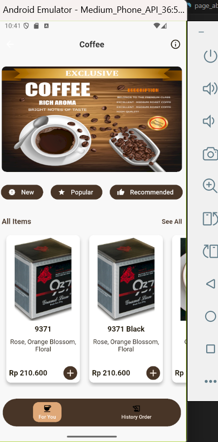

# Choffe-shop ☕️

A new Flutter project for Choffe-shop, a mobile application built with Flutter.

## 🚀 Features
- Flutter-based mobile app
- Clean UI & simple navigation
- Example pages & fragments
- Local database integration

## 🛠️ Getting Started
This project is a starting point for a Flutter application.

### Requirements:
- Flutter SDK (latest stable)
- Dart SDK (included in Flutter)
- Device or emulator to run app

### Setup Project:
```bash
flutter pub get
flutter run


